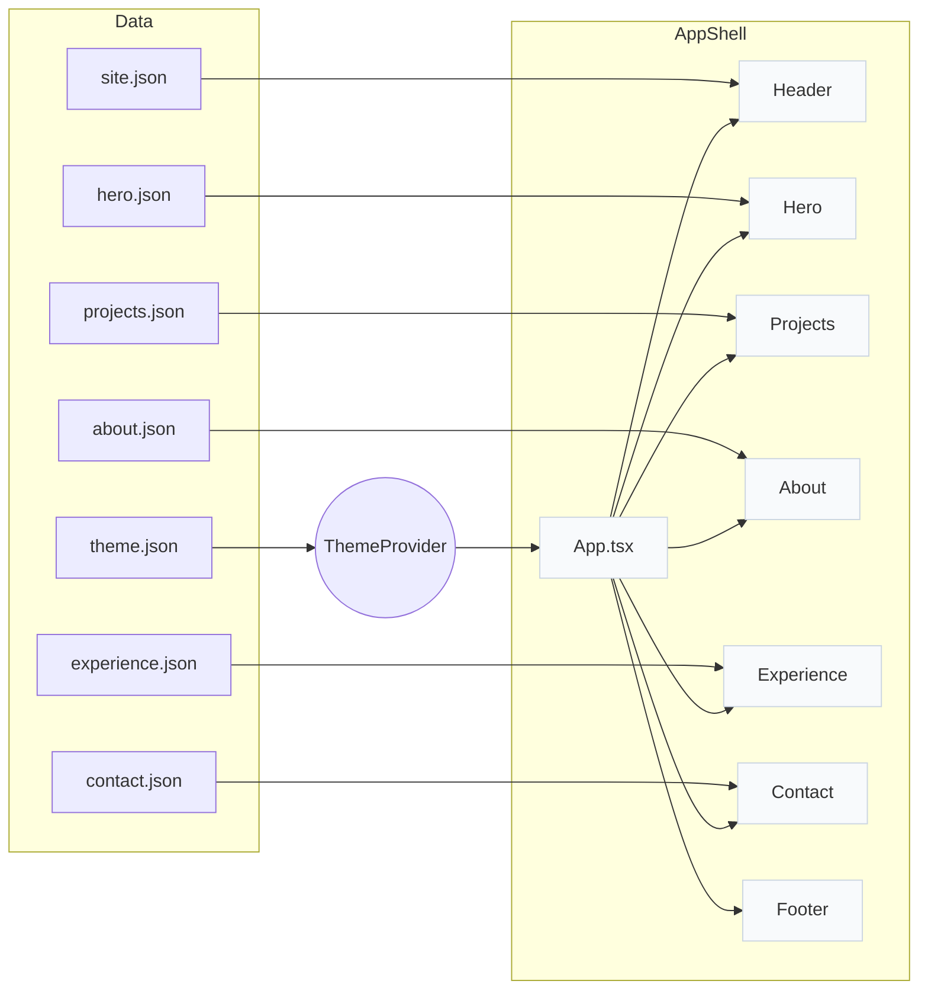
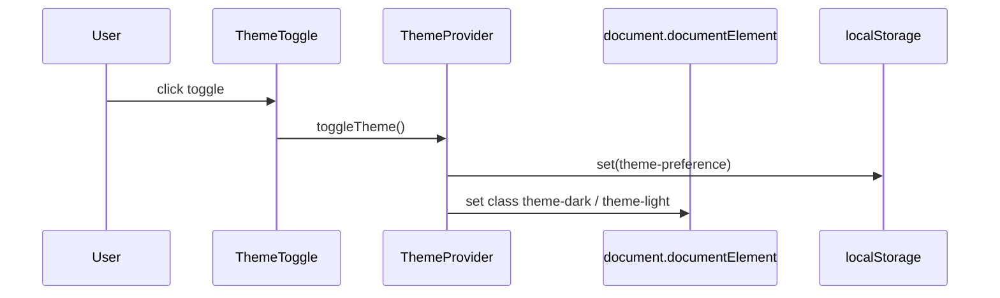

# Components & Diagrams

This file contains component diagrams and explanations. Diagrams are written in Mermaid for quick visualization.

**High-level component diagram**

**Component responsibilities**
- `Header` — renders site title and navigation from `site.json`, contains `ThemeToggle`.
- `Hero` — renders hero heading/subheading from `hero.json`.
- `Projects` — iterates `projects.json`, creates `ProjectCard` children.
- `Experience` — lists roles from `experience.json`.
- `About` — static about text from `about.json`.
- `Contact` — contact info and social links from `contact.json`.
- `ThemeProvider` — holds theme state, applies CSS classes, persists selection to `localStorage` using key from `theme.json`.

**Sequence: Theme change**

Tips for extending diagrams
- Open these files in a Markdown viewer that supports Mermaid (VS Code Markdown Preview, GitHub, etc.).
- Update the diagrams when adding components or new data files.
